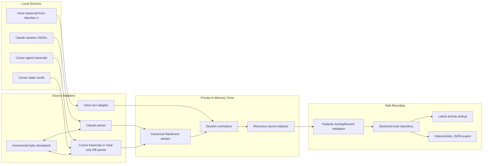
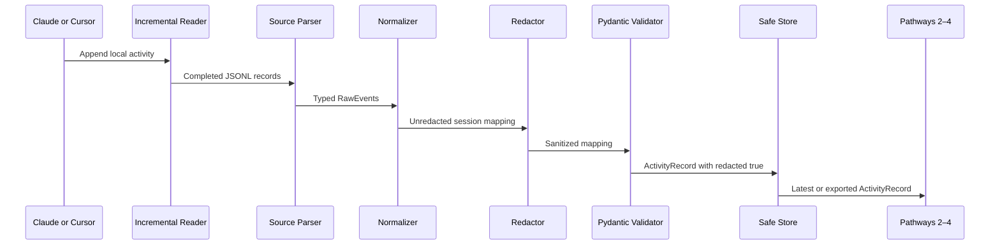

# Pathway 1 — Ingestion Architecture

## Component architecture



## Trust boundary

Everything before the Pydantic validator is private and ephemeral:

- Raw prompts
- Assistant text
- Tool inputs and results
- Diffs
- Reasoning blocks
- Cursor database values

The redactor recursively examines every string before validation. The
repository refuses any record that is not explicitly marked
`redacted: true`.

Only `ActivityRecord` crosses into Pathways 2–4.

## Processing sequence



## Canonical internal events

All source adapters map their native format into:

- `user_prompt`
- `assistant_text`
- `reasoning`
- `tool_call`
- `tool_result`
- `file_change`
- `session_end`

This prevents Claude- or Cursor-specific structures from leaking into the
public contract.

## Public contract

The canonical model is defined in
`src/virtual_you/contracts/activity.py`.

Required fields:

```text
schema_version
session_id
source
start_state
prompts[]
reasoning_summary
files_changed[]
diffs[]
tool_calls[]
end_state
timestamp_range
redacted
```

The `reasoning_summary` reports that reasoning occurred while intentionally
omitting raw chain-of-thought.

## Incremental behavior

The watcher stores:

- Byte offset
- Incomplete final-line buffer
- Source-specific checkpoint

A complete line is processed once. Partial lines are retained until the next
poll. When a new batch belongs to an existing session, its sanitized activity
is merged into the existing sanitized record.

## Failure behavior

The pipeline fails explicitly for:

- Missing source
- Malformed JSONL
- Unsupported activity events
- Empty or non-reportable sessions
- Unsafe serialized output
- Storage failures

Errors include stable codes and optional line numbers. They never contain raw
event data.

## Ownership boundary

Pathway 1 does not implement:

- Speech-to-text
- Persona generation
- LLM report drafting
- Approval workflows
- Slack or Discord delivery
- GitHub/Jira MCP enrichment

Member 4 supplies already-transcribed voice text. Members 2–4 consume only the
sanitized `ActivityRecord`.
