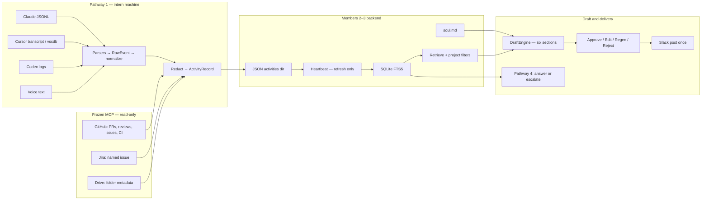
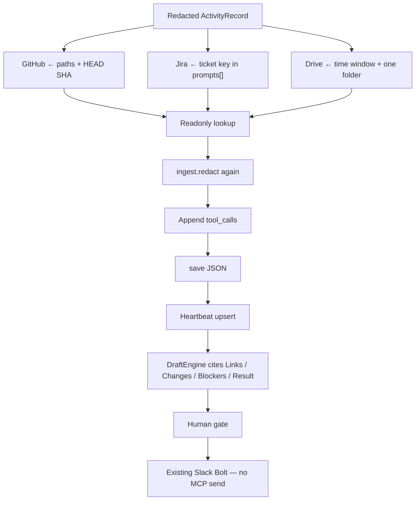
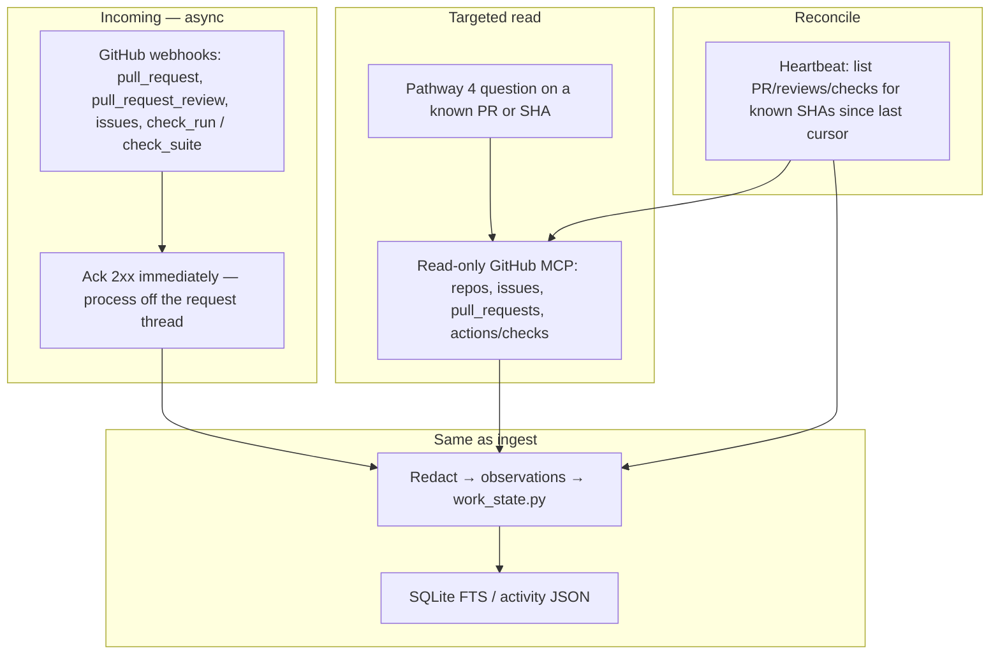

# Virtual You — Frozen MCP Plan

Status: **designed, not implemented.** AGENT.md treats this as suggest-and-review
unless Pathways 1–4 already pass team acceptance. This file is the freeze and
the development plan for when we build it.

**Frozen servers:** GitHub first (PRs, reviews, issues, CI), then Jira, then
Drive. All read-only after redaction. The Python app is the client. The draft
model never tool-calls MCP to invent a URL. GitHub is a **work-state verifier
plus an event plane**, not a link scraper. Do not add more services until
PRs + reviews + issues + CI are connected.

---

## What this is for

Virtual You drafts intern status in the user’s voice, from redacted coding-agent
sessions, then posts to Slack only after Approve. MCP does not replace ingest,
persona, or Slack. It fills facts those sessions do not have:

| MCP | Intern-life chore | Report sections it may fill |
| --- | --- | --- |
| GitHub | Pasting the PR; catching “tests passed” when CI failed; answering “what’s blocking / did CI pass / what changed after review” | Links, Result, Blockers (review + CI only) |
| Jira | Pasting `ENG-184` and guessing blocked | Links, Blockers |
| Drive | Forgetting the deck or doc | Links, Changes (title + URL only) |

Missing lookup stays `UNKNOWN`. Invented URLs still fail `invented_link`.

---

## Product architecture

Four pathways stay the product. MCP is a side door into the same redact
boundary, then the same store, retrieval, draft, and Slack path.



Heartbeat still only refreshes evidence. It never generates, approves, or sends.

Pathway 4 may cite stored GitHub observations. For **targeted** follow-ups on
the intern’s known PR/SHA it may call read-only GitHub MCP, then redact and
store before answering. It does not search the org, write, or query unrelated
services.

---

## Contract rules

`ActivityRecord` is `extra="forbid"`. phase-2 `SourceKind` is `claude | cursor |
voice`. Do **not** add `links[]`, `blockers[]`, `mcp[]`, or `source=github`.

Write enrichment into existing `tool_calls`:

```text
name: github.commit
result_summary: sha abc123f committed 2026-09-19T12:01:00Z source=github.commit

name: github.ci
result_summary: sha abc123f checks failed https://github.com/org/repo/actions/runs/9 source=github.checks verified

name: github.pr
result_summary: https://github.com/org/repo/pull/12 open #12 sha abc123f

name: github.review
result_summary: sha abc123f review CHANGES_REQUESTED by alice submitted 2026-09-19T12:10:00Z

name: github.issue
result_summary: https://github.com/org/repo/issues/4 open blocking PR #12

name: github.work_state
result_summary: The implementation is committed, but the latest CI run failed. I wouldn't call it ready yet.

name: jira.issue
result_summary: https://org.atlassian.net/browse/ENG-184 ENG-184 In Progress

name: drive.file
result_summary: https://docs.google.com/... Onboarding.pptx modified 2026-09-19
```

`github.work_state` is a **deterministic sentence** from `mcp/work_state.py`, not model
prose. Persona may dress it; DraftEngine must still cite this exact quote.

phase-2 `evidence_for` already maps `tool_calls` into citeable `Evidence`. Also
extend local `_links_text` so it regexes `tool_calls` (it currently only scans
`start_state`, `end_state`, `prompts`, `diffs`).

---

## Dev insert

The LLM must not call MCP during `assemble_prompt` / `DraftEngine.generate`.
phase-2 `validate_grounding` rejects any URL absent from evidence text.

```text
overlay_git_state
→ redact_value                 # JSONL never leaves this process
→ ActivityRecord.validate
→ mcp.enrich(record)           # flags off = no-op
→ redact_value again           # MCP JSON can contain tokens
→ validate + assert_safe_serialized
→ save activity-*.json
```

Insert in `src/virtual_you/ingest/service.py` `_finalize`, after the first
redact and validate, before `repository.save`. phase-2 heartbeat already globes
`activity-*.json` and upserts into SQLite FTS. No second store.



### Package layout

```text
src/virtual_you/mcp/
  __init__.py     enrich(record) → ActivityRecord
  extract.py      ticket regex, path list — no I/O
  clients.py      Protocol; inject fakes in tests
  github.py
  webhooks.py    # verify signature, enqueue, dedup delivery id
  work_state.py  # requested→…→deployed reducer; contradictions
  jira.py
  drive.py
```

Official MCP HTTP is optional. REST with the **same scopes** is equivalent. The
product cares about when the lookup runs and what is stored, not the wire
protocol.

| Server | Endpoint / API | Scope |
| --- | --- | --- |
| GitHub | PR + repos + **checks on one SHA** (`…/pull_requests/readonly`, `…/repos/readonly`, `…/actions/readonly` or REST) | one repo; `contents:read`, `pull_requests:read`, `checks:read` / Actions read. No workflow dispatch. |
| Jira | `mcp.atlassian.com/v2/mcp` Jira read or REST GET issue | named key only |
| Drive | `drivemcp.googleapis.com/mcp/v1` | `drive.readonly`, one folder id |

---

## GitHub MCP — work states and contradictions

This is the GitHub adapter. It is not “paste the PR URL.” It is a read-only
verifier that stops the intern from sending a status the session log cannot
prove.

### Pipeline

A revision moves through:

```text
requested → edited → committed → tests passed → merged → deployed
```

**A commit cannot establish all of those states.** Each step has one allowed
source. Session text is a *claim*, not verification.

| State | Established only by | Not established by |
| --- | --- | --- |
| requested | Redacted user prompt in this session | A commit, CI, or PR |
| edited | `files_changed` / diffs / dirty git overlay | “I finished it” in assistant text |
| committed | Git SHA: local `HEAD` overlay **and/or** GitHub commit for that SHA | Session “committed”; Cursor `succeeded` from `turn_ended` |
| tests passed | GitHub check-runs / commit statuses **success** on **that SHA** | Session “tests passed”; local pytest in JSONL; a green run on another SHA |
| tests failed | GitHub check-runs **failure** on **that SHA** | A failed tool in the editor (that is not CI) |
| merged | PR `merged` for that SHA / PR | Commit existing; CI green |
| deployed | GitHub deployment status for that SHA, if present | Merge; CI green |

If a later state is missing, Result stays at the last **verified** state and
the rest is `UNKNOWN`. Never skip ahead.

### Observations

Every GitHub (and session) fact is stored as an observation, then reduced.
Compare **only** events that share the same commit SHA, or the same task key
(session_id / Jira key already in the record). Do not use yesterday’s green CI
on `abc123` to bless today’s dirty tree.

Each observation:

```text
source        session | git_local | github.commit | github.checks | github.pr | github.review | github.issue | github.deploy
timestamp     ISO-8601 from the event, not “now” unless that is the API’s time
sha           full or unique prefix; empty if still uncommitted
task_id       session_id and ticket key if present
kind          requested | edited | committed | checks | merged | deployed
status        claim | observed | verified
detail        short redacted sentence + URL when GitHub provides one
```

Encode each observation as its own `tool_call` (`github.commit`, `github.ci`,
`github.pr`, …). `work_state.py` then appends **one** `github.work_state`
`result_summary` the draft may cite.

Verification:

- `claim` — appeared in the coding session (including “tests passed”)
- `observed` — local git overlay saw it (dirty vs HEAD)
- `verified` — GitHub API for that SHA (commit exists, checks, merge, deploy)

### Contradiction (the demo)

Editor session says tests passed. GitHub CI on the **same SHA** subsequently
fails. Virtual You must **not** draft “tests passed” or “ready to merge.”

Draft Result (cite `github.work_state` + `github.ci`):

> The implementation is committed, but the latest CI run failed. I wouldn’t
> call it ready yet.

Other required reductions:

| Session / local | GitHub on same SHA | Result sentence |
| --- | --- | --- |
| files edited, dirty tree | no commit | Edited, not committed. |
| committed, session says tests passed | no check-runs yet | Committed; tests not verified. |
| committed, session says tests passed | checks **failed** | Committed; CI failed; not ready. |
| committed | checks **success**, PR open | Committed; tests passed on this SHA; not merged. |
| committed | PR merged | Merged. Deployed stays UNKNOWN unless a deploy status exists. |
| PR open | `CHANGES_REQUESTED` or failing checks on head SHA | Blocked: cite review and/or CI. Not ready. |
| checks success on SHA A | record SHA is B | Ignore SHA A. Do not mix revisions. |

Cursor `tool_calls.status=succeeded` from `turn_ended` is a **claim**, never
`tests passed`.

`work_state.py` is a pure function over observations. The LLM does not choose
the pipeline step.

### GitHub lookups (same SHA)

After redact, resolve in order:

1. SHA from git overlay / `end_state` if it is a git summary; else GitHub
   commit that touches `files_changed` in the time window (cap 1 HEAD-like
   SHA). If none, stop at `edited`.
2. Check-runs / combined status for **that SHA only**.
3. PRs that contain that SHA (not “any PR that mentions a filename” as the
   primary key; path match is a fallback if SHA is missing).
4. Optional: deployment status for that SHA. If none, `deployed` is UNKNOWN.

Timeout / 403: keep session observations, skip GitHub `verified` rows, do not
fail ingest.

### GitHub event plane — webhooks, MCP follow-up, heartbeat

Connect **PRs, reviews, issues, and CI** on one repo before Jira, Drive, or
any other service. MCP only provides access. Virtual You still owns freshness,
permissions, deduplication, and evidence quality.



**Webhooks (push).** GitHub recommends asynchronous processing: verify
`X-Hub-Signature-256`, return 2xx, enqueue. Do not run `work_state.py` or MCP
on the webhook HTTP thread. Deduplicate by delivery id (`X-GitHub-Delivery`)
and by `(kind, sha, id)` so retries do not double-count reviews or check-runs.
Subscribe only on `VIRTUAL_YOU_GITHUB_REPO`:

| Event | Observation |
| --- | --- |
| `push` / `pull_request` synchronize | `github.commit` — new SHA |
| `pull_request` opened / closed / merged | `github.pr` — merged is the only path to `merged` |
| `pull_request_review` submitted | `github.review` — CHANGES_REQUESTED / APPROVED / COMMENTED |
| `issues` / `issue_comment` | `github.issue` — only if linked to the intern’s PR or named in the session |
| `check_run` / `check_suite` / `workflow_run` completed | `github.ci` — **that SHA only** |

Host this on `virtual-you-server` (phase-2 already has HTTPS for Slack), not
on the laptop ingest CLI. Ingest `_finalize` still SHA-seeds from git overlay
so a session without a webhook still gets a lookup.

**Read-only MCP (pull, targeted).** Use GitHub MCP toolsets `repos`,
`issues`, `pull_requests`, and checks/actions **readonly**. Call them only to
answer a follow-up about an **already known** PR number or SHA, then redact
and store the result before the draft/Pathway 4 answer. Examples:

| Manager / intern question | Toolset | Allowed query |
| --- | --- | --- |
| What’s blocking your PR? | pull_requests + checks | Requested reviewers, `CHANGES_REQUESTED`, failing checks on **this** PR’s head SHA |
| Did the fix pass CI? | checks on **this** SHA | Combined status / check-runs; never a sibling branch |
| What changed after my review? | pull_requests | Commits and files with `committed_at` / `submitted_at` **after** that review |

If the question names no PR/SHA and none is in recent evidence, escalate.
Do not org-search issues. Do not comment, approve, or dispatch workflows.

**Heartbeat (reconcile missed events).** Webhooks drop. On the existing
activity heartbeat interval, for each known intern SHA/PR since the last
cursor: list reviews, check-runs, and PR state via the same read-only client.
Insert observations the webhook missed. Heartbeat still does not draft or
send. Cursor the last successful `updated_at` so this stays bounded.

**Application duties MCP will not do for you:**

| Duty | Rule |
| --- | --- |
| Freshness | Observation timestamp is the GitHub event time. Stale warnings if checks are older than `VIRTUAL_YOU_MCP_STALE_HOURS` (reuse backend stale_hours). |
| Permissions | Fine-grained token / GitHub App on **one repo**. Intern cannot grant org admin. Webhook secret required. |
| Deduplication | Same review id or check-run id ingested twice → one observation. |
| Evidence quality | Same SHA/task compare as `work_state.py`. Session “tests passed” vs failed `check_run` on that SHA is the demo. Reviews after a new SHA do not apply to the old SHA. |

---

## Matchers

- **GitHub:** SHA first, then checks, PR, and reviews for that SHA. GitHub
  issues only when linked to that PR or named in the session. Path match only
  if SHA is missing. Cap 3 PRs / 1 SHA. Timeout. 403/timeout: skip verified
  rows, still save the session. No workflow dispatch, no org-wide Actions
  list. Webhooks + heartbeat must agree with this matcher.
- **Jira:** regex `[A-Z][A-Z0-9]+-\d+` on redacted `prompts` only. If no key, do
  not call Jira. GET that one issue. No board dump.
- **Drive:** list one `VIRTUAL_YOU_DRIVE_FOLDER_ID`. Files whose `modifiedTime`
  falls in `timestamp_range`. Store title, mime, `webViewLink`. Never
  `read_file_content`. No HR shared drives.

---

## Environment

All flags default **off**. Pytest never hits the network.

```text
VIRTUAL_YOU_MCP_GITHUB=false
VIRTUAL_YOU_GITHUB_REPO=owner/repo
GITHUB_TOKEN=                     # fine-grained: contents:read, pull_requests:read, issues:read, checks:read
                                  # Actions read for check-runs on one repo; never workflows:write
GITHUB_WEBHOOK_SECRET=            # required if webhook receiver is enabled
VIRTUAL_YOU_MCP_STALE_HOURS=24

VIRTUAL_YOU_MCP_JIRA=false
JIRA_BASE_URL=
JIRA_EMAIL=
JIRA_API_TOKEN=

VIRTUAL_YOU_MCP_DRIVE=false
VIRTUAL_YOU_DRIVE_FOLDER_ID=
```

Do not commit tokens. Reuse `assert_safe_serialized` after enrichment.

---

## Build order

1. Feature flags off; Protocol + fake client; `tests/mcp/test_enrich.py`.
2. GitHub adapter + `work_state.py` (CI contradiction on the same SHA).
3. Wire `_finalize` and `_links_text` (include `github.*` tool_calls).
4. Async webhook receiver on `virtual-you-server`: PR, review, issues,
   check_run. Dedup delivery ids. Ack then queue.
5. Heartbeat reconcile for known SHAs/PRs.
6. Pathway 4 targeted MCP follow-ups for the three questions below. Escalate
   if no PR/SHA in evidence.
7. **Stop.** Do not start Jira or Drive until the GitHub event plane answers
   those questions on one demo repo without mixing SHAs.
8. Jira adapter, then Drive adapter.
9. Confirm Slack Approve is still required; no send path through MCP or
   webhooks.

Ship GitHub against one demo repo until all of:

- Session “tests passed” + mock CI failure on the same SHA → not-ready Result
- Webhook `pull_request_review` CHANGES_REQUESTED → “what’s blocking your PR?”
  cites that review
- New SHA after a review → “what changed after my review?” only lists later
  commits
- Dropped webhook recovered on heartbeat
- Slack card still needs Approve

Then Jira. Then Drive.

---

## Tests before a live token

| Case | Expect |
| --- | --- |
| Fake GitHub returns a PR URL | Saved record has `github.pr`; Links contains that URL |
| Duplicate webhook delivery id | One observation, ingest idempotent |
| Heartbeat after dropped `check_run` | Same `github.ci` row as if the webhook arrived |
| “What’s blocking your PR?” with CHANGES_REQUESTED + failing checks | Answer cites review + CI on **this** PR head SHA |
| “Did the fix pass CI?” | Combined status for **this** SHA only |
| “What changed after my review?” | Commits/files after `submitted_at`; earlier commits omitted |
| Follow-up with no PR/SHA in evidence | Escalate; MCP not called |
| Session “tests passed” + CI failed on **same SHA** | `github.work_state` is the not-ready sentence; Result must not say tests passed |
| CI green on SHA A, record SHA is B | SHA A checks ignored; no tests-passed claim |
| Dirty tree, no SHA | State stops at edited; no committed/CI tool_calls |
| Cursor `succeeded` from `turn_ended` | Treated as claim; cannot establish tests passed |
| MCP body contains an API key | `[REDACTED]` or fail-closed; secret never on disk |
| No matching PR / SHA | No extra GitHub tool_call; ingest still succeeds |
| No Jira key in prompts | Jira client never called |
| Drive mock includes file bytes | Adapter ignores content; only title + link stored |
| All flags off | Zero network; record identical to current ingest |
| Timeout / 403 | Session saved; no verified GitHub rows; no token in logs |
| `extra=forbid` | Enriched record still validates as `ActivityRecord` |

---

## Out of freeze

Do not build:

- Linear (Jira already covers tickets)
- Azure DevOps (duplicate of GitHub + Jira)
- Org-wide GitHub Actions, workflow dispatch, GitHub issue search across
  repos, or using a green run / review on a **different SHA** as proof
- Jira or Drive **before** the GitHub event plane works on one repo
- Excel timesheet write
- Slack MCP send (Bolt already delivers)
- Calendar, Gmail, Figma
- Whole-Drive search or `read_file_content`
- Any write token
- Company inventory / portfolio / live SQL when the manager asks for a price

A stock-portfolio website that auto-updates listings is a feature of **that
website** (feed → its database → UI). Virtual You reports that the intern
shipped the feed (session + PR). It does not answer “what is the price of A.”

---

## Ownership

Pathway 1 owns session enrich and redaction. The Members 2–3 backend owns the
GitHub webhook receiver, heartbeat reconcile, and targeted MCP follow-up.
They share `work_state.py` and the same `github.*` tool_calls. Slack still
does not call GitHub itself except through that backend path.

This remains a design/plan document until the twelve team acceptance items in
`TEAM_DELIVERABLES.md` are complete, matching AGENT.md §4.
