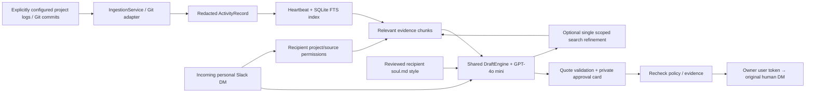

# VirtualYou: ingestion → retrieval → approved personal replies

`develop` combines `phase-2-slack-experience` (375683e) and
`phase-1.1,-complete-injestion-pipeline` (ab3c90f), whose common ingestion
baseline was `phase-1,-injestion-pipeline` (5596cae).
The upstream ingestion change is 29 files, 2,737 additions and 140 deletions.
The only textual merge conflicts were Dockerfile and .dockerignore; the more
important changes below resolve behavioral incompatibilities.

## Architecture

This follows the supplied Virtual You architecture PDF and four-member plan:
Pathway 1 owns parsing/redaction, Pathway 2 owns per-recipient presentation,
Pathways 3 and 4 share the backend's provider and grounded generation engine.
MCP and additional remote data sources remain future adapters, not prerequisites.



The persona's canonical structured style is loaded from the same profile that
exports `soul.md`. Example conversation facts never become work evidence. Each
recipient keeps an independent profile; neutral style is labeled when unreviewed.

## What changed upstream and how it is connected

| Area | Initial ingestion | Phase 1.1 | Integration decision |
| --- | --- | --- | --- |
| Sources | Claude, Cursor, voice | Adds Codex and `source_path` | Accept Codex through backend filters and Slack setup; keep source paths local |
| Claude / Cursor patches | Limited extraction | Shared patch decoder, ApplyPatch paths/renames, expanded transcript support | Index file changes and complete retained patches, not only the first few snippets |
| Cursor | Exports / SQLite | Agent transcripts, user prompt cleanup, turn-ended pairing | A turn ending does **not** prove each tool succeeded; synthetic tool results now have unknown status |
| Normalization | Session aggregation | Last user work window, public assistant approach summary | Keep CLI default; background collector opts into full-session aggregation so older changes remain searchable |
| Git overlay | None | Replaces diffs/start/end with current checkout state; 32-file / 4,000-character diff limits | Disable this overlay for historical background logs. Separate Git commit records retain explicit commit provenance and up to 500,000 patch characters, with an explicit truncation marker |
| Private reasoning | Omitted | Brief public approach summary | Also omit Codex assistant `analysis` messages; never reconstruct hidden reasoning |
| Redaction | Pattern rules | Sensitive dotenv values + expanded formats | Run redaction before normalized storage and again at retrieval boundary; no raw logs in the model request |
| Discovery / CLI | Explicit source path | `--latest`, follow watching, newest session discovery | Background config watches all matching files in an explicit project directory; never fall back to an unrelated globally newest session |
| Packaging | Backend image | CLI-only image | One non-root backend image with CLI available by command override; allowlisted Docker context excludes local credentials/data |
| DM generation | Style-only direct provider call | No Slack changes | Route through the shared DraftEngine with work evidence and citations |

Raw collection is off the message path, runs on the heartbeat, and skips unchanged
files (including SQLite WAL changes). A changed source is reparsed as a complete
session to preserve request/result pairing; this is more reliable than mixing
partial parser windows. Sessions over 50 MB fail with a visible collector error; normalized activity files are capped at 1 MB by the indexing boundary.
Voice is file-based and only reread when changed. Source files are namespaced by
project, source, path and native session ID to avoid cross-project collisions.

SQLite FTS indexes all normalized evidence fields; chunk selection bounds each
model request to 24 snippets / 18,000 evidence characters. Search covers long
patch tails instead of discarding them during indexing. Existing installations
rebuild the old truncated index once. This is lexical RAG, not vector embeddings.
The model can request one alternate keyword search, still within the same project,
source and date scope. There is no unbounded agent loop or network search. A failed citation check permits one repair call, then fails closed; the hard maximum is three calls (initial, optional search, optional repair).

General status reports use the configured recent window; targeted questions can
retrieve older authorized records. Today/yesterday use UTC boundaries; “past week”
is a rolling seven-day window. Neither commits nor editor tool requests alone
prove tests passed or deployment succeeded. Unsupported answers explicitly say
that the information was not recorded. For conversational replies the model selects source IDs and the server attaches verbatim evidence excerpts, avoiding model-retyped quote errors. Unknown IDs and unsupported uncited paragraphs fail validation. Semantic support still needs the human reviewer. Source excerpts appear in the approval card.

## Configure once, then run headlessly

Use Python 3.11+. Both ingestion and the headless Slack process share the same
`VIRTUAL_YOU_ACTIVITY_DIR` (default `<VIRTUAL_YOU_DATA_DIR>/activities`). Set:

```dotenv
VIRTUAL_YOU_INGESTION_CONFIG=/absolute/path/to/ingestion-sources.json
VIRTUAL_YOU_LLM_PROVIDER=openai
VIRTUAL_YOU_LLM_MODEL=gpt-4o-mini
VIRTUAL_YOU_HEARTBEAT_SECONDS=30
```

Keep the existing API key and OAuth credentials in your private `.env`.
`ingestion-sources.example.json` shows the source configuration; change its paths.
A source entry is **explicit authorization for that directory/project**, not a
request to find unrelated histories. Use exact project-specific log directories.
New matching sessions are picked up on the next heartbeat. Git collection records
the latest 20 reachable commits when HEAD changes; it does not report dirty files
as committed or monitor remote branches. Pull/fetch/merge remains a separate action.

In Slack Home, enable the desired sources, assign each recipient the projects they
may receive, and review their style. New contacts do not automatically inherit
access to every project. Replies always require approval and go through the
owner's user token to the original DM. A changed audience, style policy, project
assignment, or evidence record invalidates a pending grounded approval.

Existing normalized-file ingestion and authenticated normalized HTTP feeds still
work. External producers can write `activity-*.json` below a project subfolder or
use the existing activities API and explicit project assignment.

## Latency and operational limits

No ingestion, persona regeneration, full repository upload, embeddings call, or
Slack history scrape is required for each incoming question. Local FTS + bounded
chunks precede one GPT-4o mini call normally; an optional second search/generation
adds latency. Shared HTTP connection pooling is retained. Three inbox workers allow different recipients to draft concurrently; a per-recipient lock prevents duplicate generation and approval cards. Idle contacts do not delay queued messages. Stored reply metadata
includes local retrieval time, total generation time, and model-call count.
Slack's event delivery and model service remain variable. Heartbeat freshness is
bounded by the configured interval plus ingestion time. Local always-on services
still require the Mac to be awake and online.

The collector reports failures in heartbeat status without exposing raw contents.
The last valid source record can remain available after a parse failure; record
timestamps identify historical evidence, not proof of current state. Very large
patches are explicitly truncated. There is no completeness guarantee for work
that was never captured, commits beyond the configured 20-commit window on first
collection, or unrecorded rationale. MCP, embeddings, an installer and cloud
hosting are separate work.

## Verification

Tests exercise real fixture ingestion → redaction → scoped retrieval → shared
reply generation → private review, no pre-approval send, original DM/user-token
routing, duplicate approval protection, changed-evidence denial, long patch tail
search, one bounded model search refinement, Git commit provenance, project
isolation, and Codex private-analysis omission. Live OpenAI smoke tests use sanitized
synthetic evidence and never send a message to a colleague.


A live GPT-4o mini fixture smoke test completed in **4.54 seconds** with one model
call and **1.58 ms** local retrieval. This is one development measurement, not a
latency guarantee; Slack notification latency is additional. No colleague message
was sent during this check.

The subsequent smoke test against **actual redacted VirtualYou repository evidence**
completed in **4.39 seconds**, one model call, with **182 ms** local retrieval and
24 selected snippets. Source IDs resolved to server-owned verbatim excerpts. The
listener and tunnel were running with a healthy 30-second collection heartbeat.

## Trial-test 1.0: live Codex session

An explicitly configured Codex rollout file can feed the same project continuously.
The collector partitions its public events by turn and bounded 250 KB windows,
then publishes separate redacted records. Stable chunk fingerprints avoid
regenerating unchanged records. Compaction snapshots, private reasoning,
duplicated event notifications, internal instructions and image/audio blocks are
excluded. Both custom-tool and function-call formats are supported. Partial final
JSONL lines wait for the next heartbeat. Individual oversized text items are
marked and capped at 20,000 characters; this is searchable work context, not a
lossless transcript archive. Select only the intended session file, not a global
Codex directory. Enable `codex` in Slack source preferences as well.
